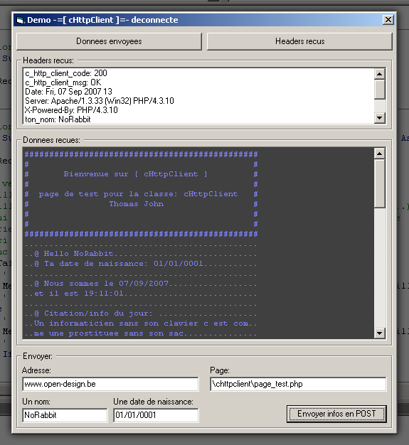



## HTTP Class \(client\) GET, POST \(files and data\), Chunks, Headers, No OCX \+ Demo

### Description

HTTP class (client side) winsock without ocx.

Sends data and files through the POST method. Also sends simple GET requests.

Processes chunked data.

Easy to send, retrieve and modify headers.

The class is even more easy to use and/or modify.

The code is commented in french but vb code stays vb code.

The demo included connects to my server, sends POST data and retrieves the results.

You can see at any moment the data being sent.

No OCX used. Even for the timers (api)

Hope you like it.
 
### More Info
 

             |
---                |---
**Submitted On**   |2007-09-09 14:40:18
**By**             |[Thomas John](https://github.com/Planet-Source-Code/PSCIndex/blob/master/ByAuthor/thomas-john.md)
**Level**          |Intermediate
**User Rating**    |5.0 (15 globes from 3 users)
**Compatibility**  |VB 6\.0
**Category**       |[Internet/ HTML](https://github.com/Planet-Source-Code/PSCIndex/blob/master/ByCategory/internet-html__1-34.md)
**World**          |[Visual Basic](https://github.com/Planet-Source-Code/PSCIndex/blob/master/ByWorld/visual-basic.md)
**Archive File**   |[HTTP\_Class2082709102007\.zip](https://github.com/Planet-Source-Code/thomas-john-http-class-client-get-post-files-and-data-chunks-headers-no-ocx-demo__1-69284/archive/master.zip)

